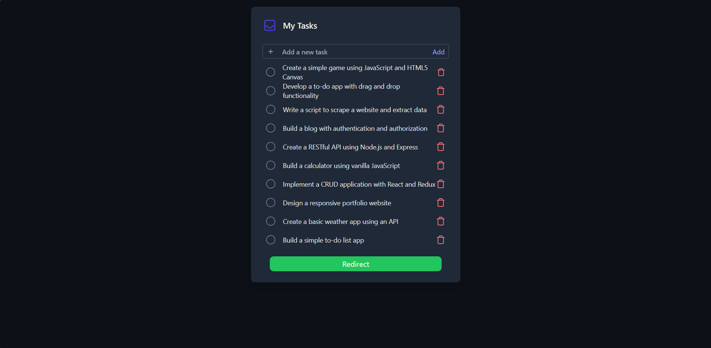

# React Todo List with RTK Query and JSON-server 📝

This is a simple To-Do list application built using React, TypeScript, Tailwind CSS, and powered by RTK Query for API state management. The data is served via JSON-server, allowing for easy mocking of backend responses. This project demonstrates the power of modern React development, providing an efficient and simple solution to managing state in a small application.

## Features 🚀

- **CRUD Operations**: Add, update, and delete tasks.
- **State Management**: Utilizes Redux Toolkit Query (RTK Query) to handle data fetching and caching seamlessly.
- **Typescript**: Ensures type safety and developer-friendly experience.
- **Tailwind CSS**: Provides utility-first CSS for a sleek and responsive UI.
- **JSON-server**: A lightweight mock API for quick backend setup.

## Tech Stack 💻

- **React**: JavaScript library for building user interfaces.
- **Redux Toolkit (RTK Query)**: A set of tools that simplifies state management and data fetching in React applications.
- **Typescript**: A strongly typed programming language that builds on JavaScript.
- **Tailwind CSS**: A utility-first CSS framework for rapidly building custom designs.
- **JSON-server**: A full fake REST API for quick prototyping.

## Features of RTK Query ⚡

- **Auto Caching**: Automatically caches data for efficient network requests.
- **Polling**: Built-in polling functionality for real-time applications.
- **Optimistic Updates**: RTK Query supports optimistic updates, allowing for more responsive applications.
- **Automatic Fetching & Mutation**: Simplifies the handling of server-side state with minimal boilerplate.
- **Error Handling**: Built-in error states and control flow for better user experience.
